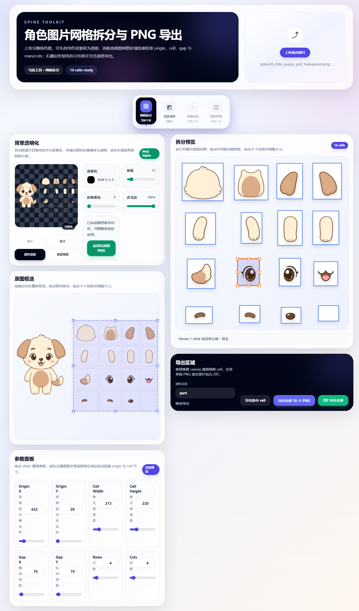
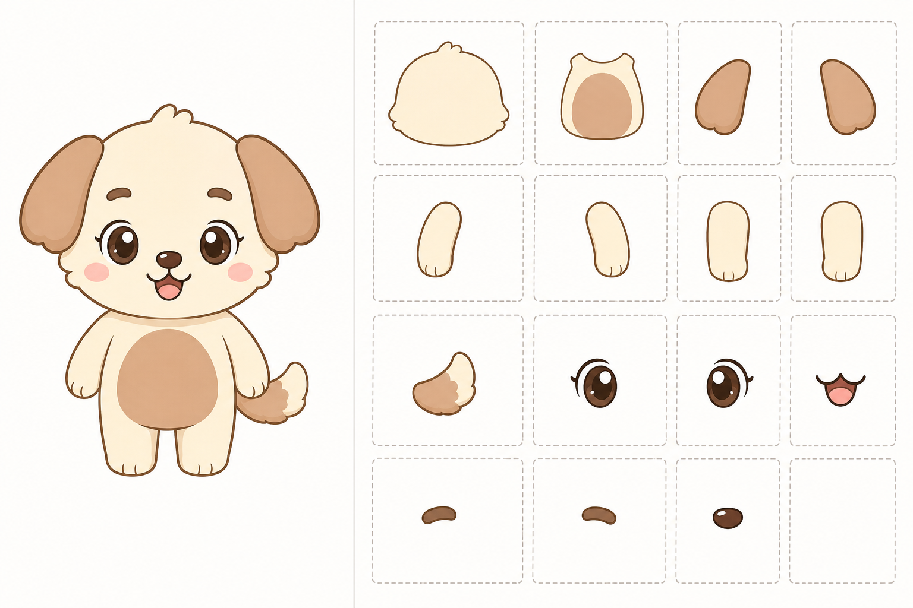

Q版可爱桌宠角色小狗，Spine2D分层素材参考图，左右分栏UI布局，严格规则网格系统

## 快速开始

### 安装依赖
```bash
npm install
# 或
pnpm install
```

### 启动开发服务器
```bash
npm run dev
# 或
pnpm dev
```

访问 http://localhost:3000 开始使用工具。

## 使用说明

### 1. 上传图片
- 点击"选择文件"按钮上传完整的角色图片
- 支持 PNG、JPG 等常见图片格式

### 2. 背景透明化处理（可选）
- 使用背景透明化工具移除图片背景
- 调整容差、柔和度和边缘清理参数
- 预览透明化效果并应用处理

### 3. 配置网格参数
- 设置网格行列数（默认 4x4）
- 调整单元格尺寸和间距
- 配置原点偏移

### 4. 网格编辑
- 在右侧网格预览中拖拽调整各部件位置和大小
- 点击选中部件进行精确调整
- 拖拽中间区域移动部件，拖拽边缘手柄调整大小

### 5. 导出结果
- 点击导出面板中的下载按钮
- 生成包含完整角色和网格布局的 PNG 文件
- 网格布局可用于程序自动切图

## 项目结构

```
spine-toolkit/
├── app/                    # Next.js 应用页面
├── components/             # React 组件
│   ├── BackgroundTransparencyTool.tsx  # 背景透明化工具
│   ├── CanvasPreview.tsx               # 画布预览组件
│   ├── ExportPanel.tsx                 # 导出面板
│   ├── GridControls.tsx                # 网格控制面板
│   └── ToolDock.tsx                    # 工具面板
├── lib/                    # 工具库
│   └── grid.ts            # 网格系统逻辑
├── assets/                 # 示例资源
│   ├── example.png        # 输入示例图片
│   └── part_cells/        # 拆分部件示例
└── outputs/               # 输出结果示例
    └── spine2d_chibi_puppy_grid.png
```

## 示例文件

### 输入示例


### 输出示例


### 部件拆分示例
assets/part_cells/ 目录包含了拆分后的各个部件：
- part_0_0.png - part_0_3.png (第一行部件)
- part_1_0.png - part_1_3.png (第二行部件)
- part_2_0.png - part_2_3.png (第三行部件)
- part_3_0.png - part_3_2.png (第四行部件)

【核心目标】
生成“完整角色 + 分层拆解”的标准化素材图
右侧所有部件可拼合还原左侧角色
右侧必须满足程序自动切图的规则网格要求

--------------------------------------------------

【布局结构】

左侧：
完整角色展示（正面）

右侧：
严格规则网格布局（重点）

👉 网格系统要求（关键）：
- 使用固定行列的矩阵布局（例如 4列 x 4行）
- 每个格子尺寸完全一致（宽高相同）
- 所有格子严格对齐（像UI设计中的栅格系统）
- 每个格子之间间距一致
- 整体呈现“标准Sprite Sheet网格”

--------------------------------------------------

【占位规则（解决你当前问题）】

即使某个部件不存在：
👉 该网格也必须保留为空白占位框（空格子）

禁止：
- 删除格子
- 改变格子大小
- 自适应内容尺寸

👉 所有格子数量固定，不因内容变化

--------------------------------------------------

【分层结构（固定槽位顺序）】

网格中固定位置（非常关键）：

第一行：
[head] [body] [ear_l] [ear_r]

第二行：
[arm_l] [arm_r] [leg_l] [leg_r]

第三行：
[tail] [eye_l] [eye_r] [mouth]

第四行：
[eyebrow_l] [eyebrow_r] [nose] [empty]

👉 每个部件必须放在固定格子中
👉 空位必须显示为空框（占位）

--------------------------------------------------

【结构拆分规则】

head：仅头部轮廓（不包含任何五官）
body：仅身体（不包含手脚尾巴）
arm / leg / tail / ear：全部独立
五官完全拆分：
eye_l / eye_r
eyebrow_l / eyebrow_r
nose
mouth

--------------------------------------------------

【一致性约束】

右侧所有部件必须：
- 来源于左侧角色拆分
- 比例完全一致
- 不重新设计

--------------------------------------------------

【网格视觉表现（重要）】

每个格子：
- 使用统一大小的“虚线框”或“卡片框”
- 框尺寸完全一致（关键）
- 内容居中放置（不拉伸格子）

👉 类似：
设计系统组件面板 / UI栅格系统 / Sprite Atlas编辑器

--------------------------------------------------

【风格锁定】

Q版治愈风格，2D平面设计，简约线条
低复杂度，柔和马卡龙配色

--------------------------------------------------

【画面要求】

纯色背景，无阴影，无透视
整体像“设计规范图 / 工程参考图”

--------------------------------------------------

【强约束（防止AI破坏网格）】

禁止：
- 不同大小格子
- 自动调整格子尺寸
- 内容撑开格子
- 删除空格子
- 不规则排版
- 部件超出格子边界

--------------------------------------------------

【负面提示词】

不规则布局，尺寸不一致，自适应排版，复杂背景，3D，写实风格，部件粘连，结构错误

--------------------------------------------------

## 技术规格

### 网格系统要求
- **固定行列布局**: 使用矩阵形式的网格布局（如 4×4）
- **统一格子尺寸**: 所有格子宽高完全一致
- **严格对齐**: 类似 UI 栅格系统，间距均匀
- **占位保留**: 即使部件不存在也要保留空格子

### 分层结构标准
- **固定槽位顺序**: 部件位置严格按照预定义布局
- **完整拆分**: 五官、手脚等部件完全独立
- **比例一致性**: 所有部件比例与原图完全一致

### 输出格式
- **PNG 格式**: 支持透明背景
- **标准化布局**: 左侧完整角色，右侧网格布局
- **程序友好**: 便于自动切图和素材导入

### 开发技术栈
- **前端框架**: Next.js + React + TypeScript
- **样式方案**: Tailwind CSS
- **画布渲染**: HTML5 Canvas API
- **图像处理**: 原生 Canvas 图像处理